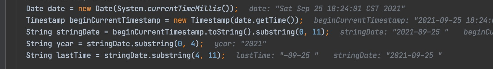

```java
  @Override
  public Building save(Building Building1) {
    Building building = new Building();
    logger.debug("判断数据是否合格");
    Assert.notNull(Building1.getName(), "name不能为空");
    Assert.notNull(Building1.getHorizontalOffset(), "水平偏移不能为空");
    Assert.notNull(Building1.getHouseType(), "类型不能为空");
    Assert.notNull(Building1.getVillage().getId(), "所属小区不能为空");
    Assert.notNull(Building1.getUnitCount(), "单元总数不能为空");
    Assert.notNull(Building1.getMaxFloor(), "最高楼未设置");
    Assert.notNull(Building1.getVerticalOffset(), "垂直偏移未设置");
    Assert.notNull(Building1.getHousesLengthOfFloor(), "每层户数未设置");

```

```java

  @Override
  public Unit update(Long id, Unit unit) {
    Assert.notNull(unit.getId(), "id type must be number");
    Assert.notNull(unit.getWeight(), "weight must be number");
    Assert.notNull(unit.getName(), "name type must be string");
```


```java
  public void validateSaveAndPostBasicData(Resident resident) {
    Assert.isNull(resident.getAccountNumber(), "AccountNumber 接收到的居民属性不全");
    Assert.isNull(resident.getChronicDiseaseDetails(), "chronicDiseaseDetails 接收到的居民属性不全");
    Assert.isNull(resident.getBeCrimed(), "BeCrimed接收到的居民属性不全");
    Assert.isNull(resident.getBeCultMember(), "BeCultMember接收到的居民属性不全");
    Assert.isNull(resident.getBeDisabled(), "getBeDisabled()接收到的居民属性不全");
```


```java
    if (isOwner) {
      Resident resident = this.residentRepository.findById(residentId).orElseThrow(() -> new EntityNotFoundException("居民实体不存在"));

      house.setOwner(resident);
    } else {
      if (house.getOwner().getId().equals(residentId)) {
        house.setOwner(null);
      }
    }
```


```java

@Entity
@SQLDelete(sql = "update `jobType` set deleted = 1 where id = ?")
@Where(clause = "deleted = false")
public class JobType extends BaseEntity {
```


```java

      logger.debug("初始化矫正类型");
      List<CrimedType> crimedTypes = new ArrayList<>();
      crimedTypes.add(new CrimedType(CrimedType.DRUG, "吸毒"));
      crimedTypes.add(new CrimedType(CrimedType.LABOR_EDUCATION, "劳教"));
      crimedTypes.add(new CrimedType(CrimedType.IN_PRISON, "服刑"));
      crimedTypeRepository.saveAll(crimedTypes);

      /**
       * 矫正类型.
       */
      public static Long LABOR_EDUCATION = 1L;
      public static Long IN_PRISON = 2L;
      public static Long DRUG = 3L;
```


```java
UserServiceImpl

  @Override
  public List<Long> getChildrenIdsWithItself(District district) {
    List<Long> districtsId = new ArrayList<>();
    if (district != null && district.getId() != null ) {
      districtsId.add(district.getId());
    }

    district.getChildren().forEach(d -> {
      districtsId.addAll(this.getChildrenIdsWithItself(d));
    });

    return districtsId;
  }

  
```


```java
  public Page<Resident> page(String name, String phone, String idNumber, String workPlace, Short politicalClimate, Short education, String religion, Long regionId, Integer beginAge, Integer endAge, Short nationality, Short sex, Pageable pageable) {

```

```java
  public static Specification<Resident> equalIdNumber(String idNumber) {
    if (idNumber == null && !idNumber.trim().isEmpty()) {
      return Specification.where(null);
```


```java

    if (beginAge != null && endAge == null) {
      Timestamp beginTimestamp = getTimeStamp(beginAge, year, lastTime);
      return (Specification<Resident>) (root, criteriaQuery, criteriaBuilder) -> criteriaBuilder.greaterThan(root.get("dateOfBirth").as(Timestamp.class), beginTimestamp);
    }

    if (beginAge == null && endAge != null) {
      Timestamp endTimestamp = getTimeStamp(endAge, year, lastTime);
      return (Specification<Resident>) (root, criteriaQuery, criteriaBuilder) -> criteriaBuilder.lessThan(root.get("dateOfBirth").as(Timestamp.class), endTimestamp);
    }
    
    if (beginAge != null && endAge != null) {
      Timestamp beginTimestamp = getTimeStamp(beginAge, year, lastTime);
      Timestamp endTimestamp = getTimeStamp(endAge, year, lastTime);
      return (Specification<Resident>) (root, criteriaQuery, criteriaBuilder) -> criteriaBuilder.between(root.get("dateOfBirth").as(Timestamp.class), endTimestamp, beginTimestamp);
    }
```


```java
    logger.debug("首先初始化保存数据");
    Resident resident1 = ResidentControllerTest.getOneResident();
    resident1.setIdNumber("130131200101130958");
    residentRepository.save(resident1);
    Resident resident2 = ResidentControllerTest.getOneResident();
    resident2.setIdNumber("130131200301130958");
    residentRepository.save(resident2);
    Resident resident3 = ResidentControllerTest.getOneResident();
    resident3.setIdNumber("130131200501130958");
    residentRepository.save(resident3);

    logger.debug("查询数据");
    logger.debug("完整的年龄输入");
    List<Resident> residents1 = this.residentRepository.findAll(ResidentSpecs.betweenAge(17, 20));

    logger.debug("输入开始年龄的");
    List<Resident> residents2 = this.residentRepository.findAll(ResidentSpecs.betweenAge(20, null));

    logger.debug("输入结束年龄的");
    List<Resident> residents3 = this.residentRepository.findAll(ResidentSpecs.betweenAge(null, 14));
    logger.debug("查询数据");
    logger.debug("完整的年龄输入");
    Assertions.assertEquals(1, this.residentRepository.findAll(ResidentSpecs.betweenAge(17, 20)).size());

    logger.debug("输入开始年龄的");
    Assertions.assertEquals(1, this.residentRepository.findAll(ResidentSpecs.betweenAge(20, null)).size());

    logger.debug("输入结束年龄的");
    Assertions.assertEquals(0, this.residentRepository.findAll(ResidentSpecs.betweenAge(null, 14)));
    }

```



```java

    // 获取当前时间，并获取到当前日期
    Date date = new Date(System.currentTimeMillis());
    Timestamp beginCurrentTimestamp = new Timestamp(date.getTime());
    String stringDate = beginCurrentTimestamp.toString().substring(0, 11);
    String year = stringDate.substring(0, 4);
    String lastTime = stringDate.substring(4, 11);


    if (beginAge != null) {
      Timestamp beginTimestamp = getTimeStamp(beginAge, year, lastTime);
      specification.and((root, criteriaQuery, criteriaBuilder) ->
          criteriaBuilder.greaterThan(root.get("dateOfBirth").as(Timestamp.class), beginTimestamp));
    }

    if (endAge != null) {
      Timestamp endTimestamp = getTimeStamp(endAge, year, lastTime);
      specification.and((root, criteriaQuery, criteriaBuilder) ->
          criteriaBuilder.lessThan(root.get("dateOfBirth").as(Timestamp.class), endTimestamp));
    }
```